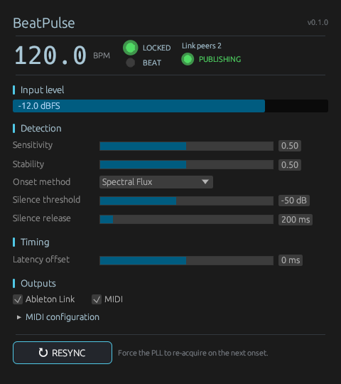

# BeatPulse

Real-time beat detector VST3 + CLAP plugin that broadcasts the detected
tempo to an [Ableton Link](https://www.ableton.com/en/link/) session and
emits parallel MIDI Note/CC pulses.

Primary downstream target: **Daslight 5** (DMX) via Link tempo source.
Primary host: **FL Studio** on Windows. Should work in any VST3 or CLAP
host.



## Status

**0.x — works in hosted VST3/CLAP environments; no tagged release yet.**
80 unit + integration tests pass on `main`. CI runs `rustfmt`, `clippy`,
the full test suite on Linux + Windows, the in-process Ableton Link
listener test, and the bundle build. Plugin-conformance gates
(pluginval, clap-validator) and the Daslight 5 end-to-end manual check
are still pending — see [`docs/TESTING.md`](docs/TESTING.md) §F1–F5.

See [`BeatPulse-SPEC.md`](BeatPulse-SPEC.md) for the design and
[`docs/adr/`](docs/adr/) for architecture decisions.

## Features

- **Real-time beat detection.** aubio onset detector (7 selectable
  algorithms) feeding a custom phase-locked loop with cold-start snap,
  octave correction, and configurable smoothing.
- **Ableton Link tempo broadcast.** Joins the Link session as soon as
  the plugin loads. Status indicator distinguishes `OFF / JOINED /
  PUBLISHING` so you can see whether tempo is actually flowing.
- **Parallel MIDI output.** Note + CC at configurable PPQN (1, 2, 4,
  8, 16, 24), MIDI channel, CC number, value mode (Fixed / Toggle), or
  Note number / velocity / length. Independent of the Link path.
- **Decoupled controls.** Sensitivity (aubio threshold + phase-lock
  rate) and Stability (period smoothing) are separate knobs — no
  fighting between "detect more onsets" and "less BPM jitter".
- **Latency calibration.** Per-instance `Latency offset` slider
  (±200 ms) so DMX cues align with the perceived audio after host
  buffer + driver + speaker delay.
- **Resizable editor.** In-canvas drag handle in the bottom-right
  corner; persisted per instance.
- **Live UI feedback.** Hero monospace BPM with `±σ` annotation when
  unstable, LOCKED LED, BEAT LED (one flash per beat regardless of
  PPQN), input level meter, Link peer count.

## License

**GPL-3.0-or-later.** Forced by the combination of:

- `aubio` (LGPL-3) — onset detection
- Ableton Link (GPL-2-or-later) — tempo broadcast

See [`LICENSE`](LICENSE) and [`docs/adr/0009-gpl3-licensing.md`](docs/adr/0009-gpl3-licensing.md).

## Build

Prerequisites:

- Rust ≥ 1.75 (`rustup install stable`)
- CMake ≥ 3.14 (used by `rusty_link` to build Ableton Link's bundled C++)
- LLVM / libclang (used by `bindgen` for the aubio + Link FFI). On
  Windows: `winget install LLVM.LLVM`. On Linux: `apt install
  libclang-dev`. On macOS: ships with Xcode.
- A C/C++ toolchain (MSVC on Windows, gcc/clang on Linux).

```bash
git clone https://github.com/lhns/beatpulse.git
cd beatpulse
cargo build --release
cargo xtask bundle beatpulse --release
```

Bundles land in `target/bundled/`. Install paths:

| OS      | VST3                                       | CLAP                                       |
|---------|--------------------------------------------|--------------------------------------------|
| Windows | `C:\Program Files\Common Files\VST3\`      | `C:\Program Files\Common Files\CLAP\`      |
| Linux   | `~/.vst3/`                                  | `~/.clap/`                                  |
| macOS   | `~/Library/Audio/Plug-Ins/VST3/`            | `~/Library/Audio/Plug-Ins/CLAP/`            |

## Test

```bash
cargo test                                          # 80 default tests
cargo test --features link-integration              # + 1 Ableton Link loopback test (~40 s)
cargo test --features dataset-tests                 # + Ballroom F-measure (set BEATPULSE_BALLROOM_DIR)
cargo test --features ui-snapshots                  # + UI snapshots → tests/data/output/*.png
```

Plugin conformance (run after bundling):

```bash
pluginval --strictness-level 5 --validate target/bundled/beatpulse.vst3
clap-validator validate target/bundled/beatpulse.clap
```

Full testing reference: [`docs/TESTING.md`](docs/TESTING.md).

## Manual end-to-end with Daslight 5

1. Load BeatPulse on an FL Studio mixer channel with a 120 BPM kick loop.
2. In Daslight 5: Settings → Audio → enable Ableton Link.
3. BeatPulse's `LOCKED` LED lights after ~4–8 beats. The Link status
   changes to `PUBLISHING`. Daslight's BPM display follows BeatPulse
   within ~1 second.
4. Stop the kick. Daslight's tempo holds at the last published value
   (Link doesn't "release" tempo).
5. Restart with a different BPM. Daslight converges within ~10 s.

If Daslight reports zero peers:

- Confirm both machines are on the same subnet.
- Allow multicast through Windows Defender (private network profile).
- Disable VPN clients that block multicast.

If DMX cues fire visibly early relative to the audio: increase
`Latency offset` (negative direction; start with `-(host buffer size in
ms)` as a baseline, then fine-tune by eye).

## Known limitations

- **Resize via host chrome doesn't work; use the in-canvas drag handle.**
  The editor has a drag-handle in its bottom-right corner — drag that
  to grow the window. Dragging the host's plugin-window border may
  show a resize cursor but the plugin contents stay put. This is an
  upstream nih-plug limitation (`Editor` trait has no `on_size`
  callback yet); see [`docs/adr/0022-host-driven-resize-unsupported.md`](docs/adr/0022-host-driven-resize-unsupported.md).
- **Latency calibration is per-host, per-buffer.** Set `Latency offset`
  manually for your setup; the plugin doesn't auto-detect host buffer
  latency. See [`docs/adr/0023`](docs/adr/0023-latency-offset-user-tunable.md).
- **Single-instance Link.** Only enable Ableton Link on one BeatPulse
  instance per session — multiple instances fight over the session
  tempo (last write wins). See [`docs/adr/0012`](docs/adr/0012-single-instance-link-last-write-wins.md).
- **Beat-tracking accuracy depends on input cleanliness.** Designed for
  isolated rhythmic sources (kick bus, drum loop). On full-mix audio,
  the PLL may lock to a sub-rhythm rather than the perceived downbeat.
  See [`docs/adr/0003`](docs/adr/0003-aubio-over-madmom-beatnet.md).

## Architecture

See [`BeatPulse-SPEC.md`](BeatPulse-SPEC.md) and [`docs/adr/`](docs/adr/).
